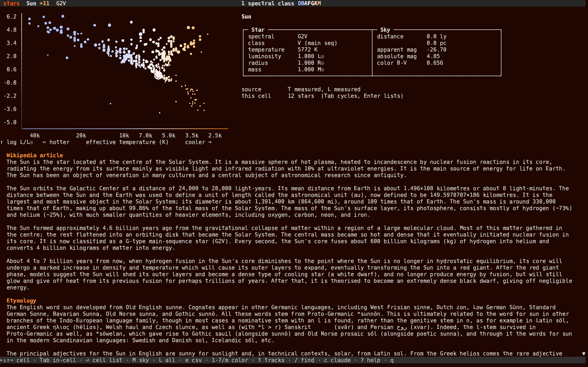
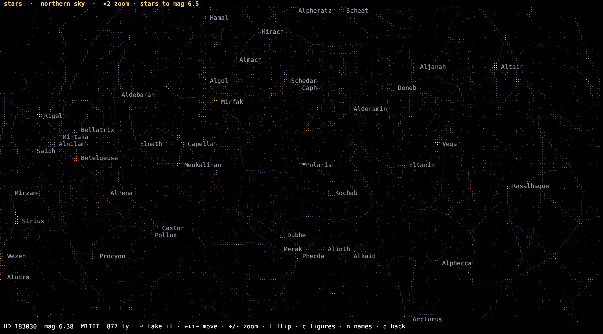
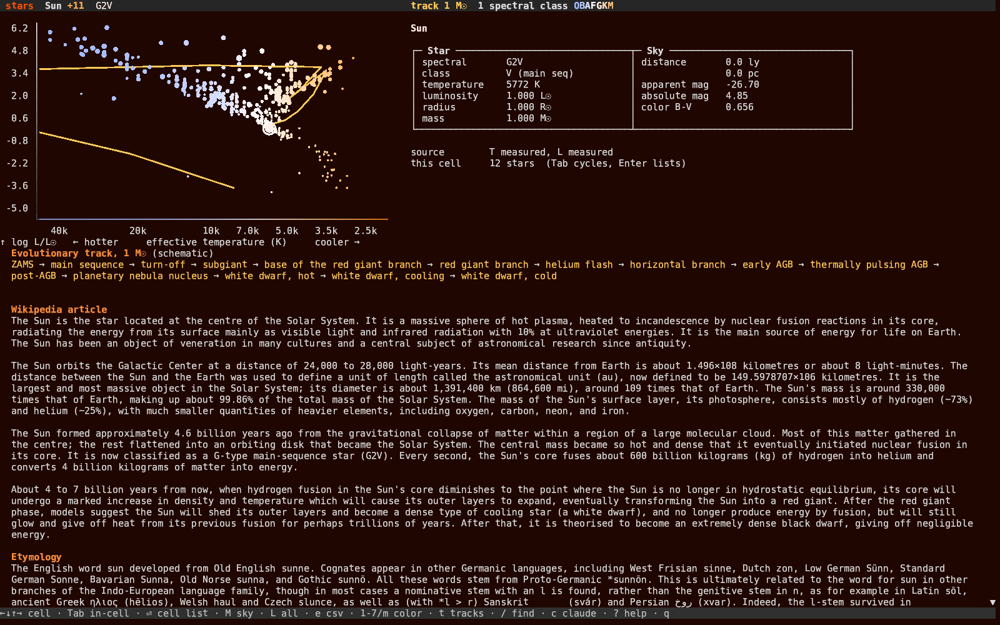

# stars


**The Hertzsprung-Russell diagram in your terminal. Written in Rust.**

   

Every named star with a measured parallax, plotted where it belongs on the HR diagram: temperature across, luminosity up. Walk between them with the arrow keys, read each star's numbers and its full Wikipedia article, and lay schematic evolutionary tracks over the plot to see where a star of a given mass goes when it leaves the main sequence. Built on [Crust](https://github.com/isene/crust), part of the [Fe2O3 suite](https://github.com/isene/fe2o3).



## Features

- **461 named stars** from the HYG catalog, plotted in log Teff against log luminosity
- **Walk the diagram**: the arrow keys move cell by cell, so you can climb the main sequence and cross into the giants. `Tab` cycles the stars sharing a cell, `Enter` opens them as a pick list you walk with ↓↑ and choose from
- **The whole catalog as a list** (`L`), ordered by whatever the color mode is asking: hottest, nearest, brightest, heaviest, largest. `e` writes the same ordering to `~/stars-by-<mode>.csv`, every column included
- **Seven color modes** (keys 1-7, `m` for the menu, or Ctrl+←/→): spectral class in true star colors, luminosity class, distance, apparent magnitude, mass, radius, and data source
- **Evolutionary tracks** (`t`): schematic paths for 1, 5 and 15 M☉, with their stages named below the diagram, from ZAMS through the giant branch to a white dwarf or a supernova
- **Honest about its numbers**: measured values come from Wikidata, the rest are derived from the spectral type and absolute magnitude, and mode 7 colors the diagram by which is which
- **The right Wikipedia article**: a star's IAU name is often a word first (Tupi is a people, Anser a genus of geese, Pollux a demigod), so each candidate page is checked before it is kept, falling through to `<name> (star)` and the HD / HIP designations. Cached locally for 445 of the 461
- **Pick a star off the sky** (`M`): the celestial sphere in braille, 9,096 stars from the Bright Star Catalogue, `f` flips between the northern and southern half, `+`/`-` zoom, and `Enter` brings the star under the crosshair back to the diagram. One the catalog knows arrives with its article; anything else joins as a guest, placed from its Hipparcos distance and Bright Star colour. Drawn by [starmap](https://github.com/isene/starmap)
- **Ask Claude** (`c`) about the star you are looking at, with its data and article as context
- **Zero idle cost**: event-driven, no timers, no polling
- **Offline**: one fetch, then everything is local

### The sky

Press `M` and the celestial sphere comes up in braille. Walk it with the
arrows, `f` flips between the northern and southern half, `+`/`-` zoom
about the crosshair, and the star under it is named at the bottom with
its magnitude, spectral type and distance. `Enter` takes it back to the
diagram.



### Evolutionary tracks

Press `t` and a schematic track for 1, 5 or 15 M☉ is laid over the diagram, with every stage named below it: up the giant branch, back across the top at constant luminosity as a planetary nebula nucleus, then down the white dwarf cooling track.



## Install

Download the prebuilt binary from [Releases](https://github.com/isene/stars/releases), or build from source:

```bash
cargo build --release
cp target/release/stars ~/.local/bin/
```

First start builds the catalog (about three minutes), then the app works offline.

## Key Bindings

| Key | Action |
|-----|--------|
| ← ↑ ↓ →, h/j/k/l | Move one cell that way on the diagram |
| Tab, Shift+Tab | Next / previous star within the current cell |
| Enter | List every star in the cell; ↓↑ walks it, Enter picks |
| L | List the whole catalog, ordered by the current color mode |
| e | Export that ordered list to `~/stars-by-<mode>.csv` |
| < >, n p | Previous / next star in the catalog |
| 1-7, Ctrl+←/→ | Color mode |
| m | Mode menu |
| M | The sky: walk it with the arrows, `f` flips north / south, `+`/`-` zoom, `c` figures, `n` names, `Enter` takes that star to the diagram |
| t | Evolutionary tracks: off → 1 M☉ → 5 M☉ → 15 M☉ → all |
| J K, Shift+↓/↑ | Scroll the article one line |
| Space, PgUp/PgDn | Scroll the article one page |
| g G | Top / bottom of the article |
| / | Find a star by name |
| c | Ask Claude about this star (follow-ups keep context) |
| C | Toggle the Claude conversation view |
| w | Open the star's Wikipedia page in the browser |
| u | Rebuild the catalog |
| ? | Help |
| ESC | Back to the article (quits from the article view) |
| q | Quit |

## CLI

```
stars [STAR] [--fetch]
```

`STAR` starts at (or, when piped, prints) that star. `--fetch` rebuilds the catalog.

## Where the numbers come from

Positions, magnitudes, spectral types and distances come from the [HYG database](https://github.com/astronexus/HYG-Database) (Hipparcos + Yale + Gliese). Rows without a usable parallax are dropped, since their absolute magnitudes are meaningless.

Effective temperatures, luminosities, radii and masses come from Wikidata where they are published (119 stars have a measured temperature). Everything else is derived: temperature from the spectral type on the standard main-sequence scale, or from the B-V color index via Ballesteros' formula; luminosity from radius and temperature, or from the absolute magnitude with a bolometric correction. The detail panel names the source for every star, and color mode 7 shows it across the whole diagram.

Stars picked off the sky map (`M`) come from the [Yale Bright Star Catalogue](http://tdc-www.harvard.edu/catalogs/bsc5.html) with [Hipparcos](https://cdsarc.cds.unistra.fr/viz-bin/cat/I/239) parallaxes, via [starmap](https://github.com/isene/starmap). Their temperature and luminosity are derived, never measured, and the detail panel says so.

**The evolutionary tracks are schematic.** They show the shape and the order of the stages a star of that mass passes through, not a computed stellar model.

## License

Public domain (Unlicense). Created by [Geir Isene](https://isene.com).
